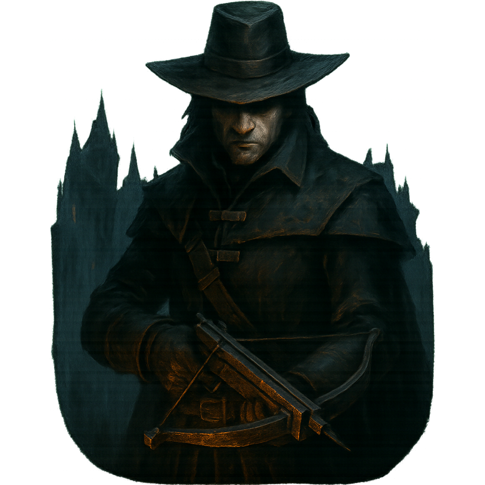

<h1 style="float:left;"> Tile Monster Hunter</h1>

Title Monster Hunter is a Triple Tile Match game where you play as a monster hunter and destroy all evil spirits in his path.

## Roadmap
##### MVP
- [ ] Tile field generation
- [ ] Tile field cleaning mechanics
- [ ] Tiles action bar mechanics
- [ ] Level start animation (hourglass effect)
- [ ] Gravitational subsidence of the remaining tiles when one is removed
- [ ] Tile field refresh ability
- [ ] Win/Lose screens

##### Features
- [ ] Tile abilities (heavy, sticky, frozen, explosive, time affective)
- [ ] Level time limit
- [ ] Progress saving
- [ ] Plot dialogues
- [ ] Several levels
- [ ] Energy indicator for level completion/restart (filling by time/viewing ads)
